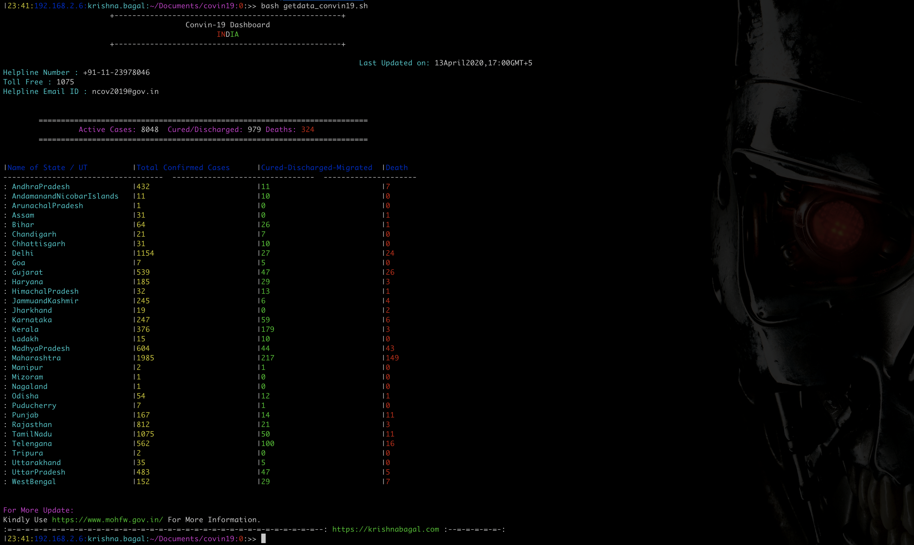

# COVID-19 Dashboard
---

Let’s see a simple bash script to demonstrate the state-wise corona virus cases in India. This bash script fetches the live data from Ministry of Health Affairs Official Website. i.e  https://www.mohfw.gov.in/

To run below script use,

```
# bash getdata_convid19.sh	
```
Then you will get an simple state-wise dashboard.


